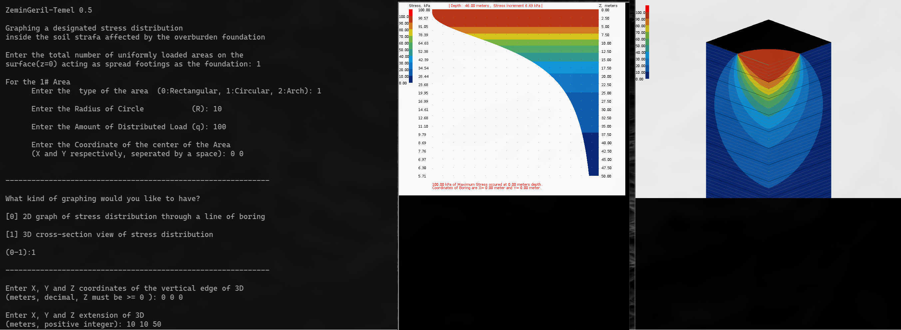

# ZeminGeril



A ground engineering software developed by Bora Okumusoglu for estimating stress distribution in the semi-infinite solid body (the ground) resulting from surface loads. The software was initially programmed in 2005–2006 as part of his Master's thesis titled [Stress distribution and elasto plastic settlements under shallow foundations](https://tez.yok.gov.tr/UlusalTezMerkezi/TezGoster?key=-Z0vbSUgrhM9fXoGkRe6Q8zJ7Sk7W31SHEFOFRvy43ZoScM4g3rcZCg_NG_0hva7).

### Recent Improvement

* Multihreading for greatly faster calculations starting at [Commit 822fe44](https://github.com/boraoku/zemingeril/commit/822fe445ded25017b4b9a449a1ac9d50ac1fadff).

* Code refactoring to ease future work like [Commit 2d8403f](https://github.com/boraoku/zemingeril/commit/2d8403fe3239167caf37af1489af84eb7b7a6c4a).

* Ready-to-use executable files (binaries) for all (Windows, Linux and Mac) PC platforms as listed under [Releases](https://github.com/boraoku/zemingeril/releases).

### Requirements

X11 is required to compile the code in Linux / Mac environment. Mac OS X will require [XQuartz](https://www.xquartz.org).

In Windows, nothing is required except a C++ compiler like [Visual Studio(VS)](https://code.visualstudio.com/docs/cpp/config-mingw).

### Compiling & Running

For Linux / Mac environment, simply use the makefile by
```bash
cd source
make
```

And then run the compiled code:
```bash
cd .. # go back to top directory
cd build
./ZeminGeril
```

For Windows, just use the provided VS file `ZeminGeril.sln` to compile. 

There are some precompiled files under `build` folder. Windows EXE file will require [Microsoft Visual C++ Redistributable](https://docs.microsoft.com/en-us/cpp/windows/latest-supported-vc-redist?view=msvc-170) runtime files installed on the system.

### 
License

MIT
